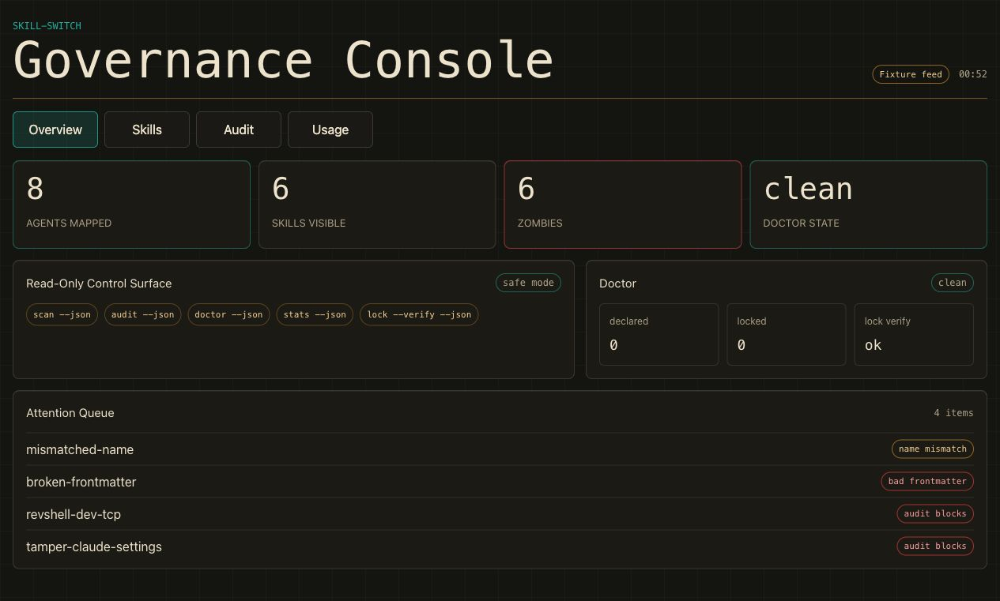
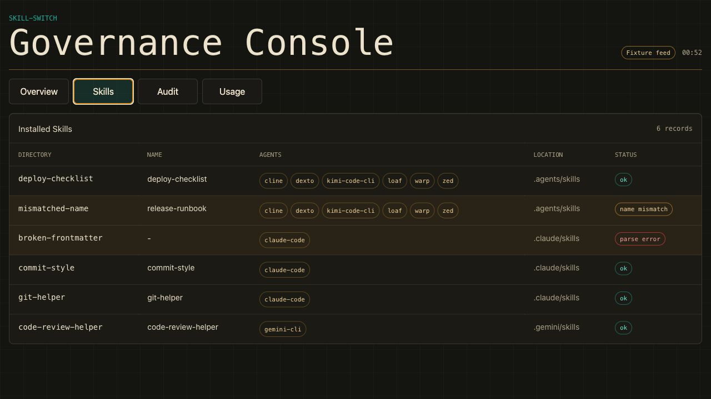
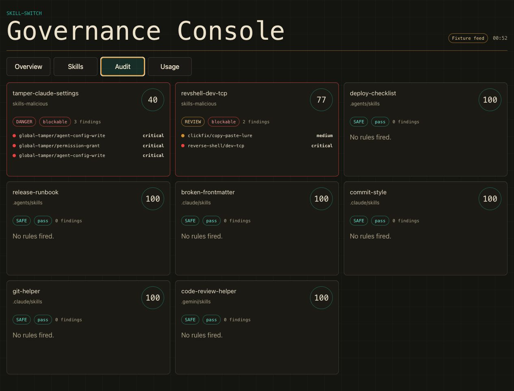
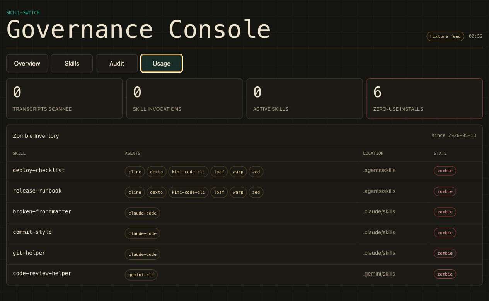

# skill-switch

<p align="center"><a href="./README.md">简体中文</a> · <b>English</b></p>

[](https://www.npmjs.com/package/@rtwsvj/skill-switch)
[](https://github.com/rtwsvj/skill-switch/releases)
[](./LICENSE)
[](https://github.com/rtwsvj/skill-switch/releases/latest)
[](https://github.com/rtwsvj/skill-switch/actions/workflows/ci.yml)

**Security audit for AI agent skills & MCP configs.** Scan the skills and MCP/agent configs of Claude Code, Cursor, Gemini CLI, Windsurf, Zed, and VS Code for **reverse shells, data exfiltration, credential phishing, dangerous MCP servers, plaintext remote transport, and hardcoded secrets** — 80+ detection rules, **1,600+ tests**. Emit **SARIF straight into GitHub code-scanning**, set a project policy (`.skill-switch-policy.json`), and apply guided fixes (`--fix`).

```bash
npx @rtwsvj/skill-switch audit            # audit this project's skills / configs
npx @rtwsvj/skill-switch audit --configs  # also scan ~/.claude, MCP, and agent configs
```

Or drop the [GitHub Action](docs/github-action.md) into CI to audit every PR and upload results to code-scanning.

On top of auditing, it's also a **cross-agent skill governance layer**: inventory, toggle, install, sync, and roll back — every write is **snapshotted first and one-click reversible**, and dangerous skills are blocked before they install. Available as a **CLI** (`npx @rtwsvj/skill-switch`) and a signed + notarized **desktop app (GUI)**.



## Why

AI coding agents increasingly run on *skills* — reusable bundles of instructions and tools. As you accumulate them across several agents, you lose the thread: which are installed where, did that one quietly ask for your `.env`, is the copy on disk still the one you vetted? A skill is just files an agent will execute — so a bad one can open a reverse shell, exfiltrate secrets, or smuggle in hidden prompt-injection. skill-switch is the governance + safety layer that keeps all of that under control, locally, with no telemetry.

## Screenshots






## Highlights

- **Safety net** — every write (`install` / `toggle` / `sync` / `remove` / `restore`) takes a `tar.gz` snapshot *before* touching disk; one-click rollback to any point in time from the History view.
- **Pre-install security gate** — every skill is audited before it lands; reverse shells, secret exfiltration, phishing for credentials, and prompt-injection / hidden instructions get blocked. Forcing past the gate is recorded.
- **Three-way reconciliation** — `skills.json` (declared) × `skills.lock.json` (locked) × disk; `doctor` flags drift (`--ci` exits 1 on any mismatch).
- **Cross-agent** — one governance layer over claude-code / codex / gemini-cli / cursor / copilot.
- **Zero telemetry, local-first** — collects nothing, uploads nothing, no account; works fully offline after install (only an explicit `install` from a git source ever hits the network).
- **4 languages** — English / 简体中文 / 日本語 / Español.

## Install (macOS, Apple Silicon)

1. Download `skill-switch_0.7.0_aarch64.dmg` from the [latest release](https://github.com/rtwsvj/skill-switch/releases/latest).
2. Open it and drag **skill-switch** into Applications.
3. It's signed with a Developer ID and notarized by Apple, so it opens with a double-click — Gatekeeper won't block it.

The app only writes to your tools' skill directories (`~/.claude`, `~/.codex`, `~/.gemini`, …) when you explicitly click Install / Disable / Delete / Sync / Restore — and it snapshots before every write.

## CLI

The CLI ships inside the app at `/Applications/skill-switch.app/Contents/MacOS/skill-switch-cli`. Link it onto your `PATH`:

```bash
ln -sf /Applications/skill-switch.app/Contents/MacOS/skill-switch-cli /usr/local/bin/skill-switch
skill-switch --help
```

> Tip: add `--home <some empty dir>` to any command to operate inside a throwaway sandbox that never touches your real config.

| Command | Purpose |
|---|---|
| `status` | One-glance overview: skill counts, agents detected, declaration/lock health (read-only; start here). |
| `scan` | Inventory installed skills per tool (read-only). |
| `init` | Scan installed skills and draft an initial `skills.json` (skips if one exists; `--force` to overwrite, `--dry-run` to preview). |
| `audit` | Security audit; any critical/high or score < 70 → exit 1. Add `--configs` to also audit agent config files (settings.json / MCP), covering Claude Code, Gemini CLI, Cursor, and VS Code. |
| `ci` | Scaffold a GitHub Actions workflow (`.github/workflows/skill-switch.yml`) in one command. `--format sarif` (default, uploads to code-scanning) or `--format github` (inline PR annotations); `--pin <ref>` to pin the action version; `--baseline` to also write a finding baseline so CI only fails on new findings; `--force` to overwrite an existing file. |
| `install` | Install from a local or git source (audits + snapshots first). |
| `toggle` | Enable/disable a single skill per the declaration. |
| `sync` | Apply the declaration to disk (`--dry-run` to preview). |
| `remove` | Consistent teardown: disk + lock + declaration together. |
| `restore` | List / restore snapshots (`--latest` or `--id`). |
| `lint` | Spec checks + cross-tool portability + conflict/budget health. |
| `doctor` | Declared × locked × disk reconciliation (`--ci` exits 1 on drift). Also prints a "Config security:" advisory section summarizing critical/high config findings; `--json` includes a `configAudit` field (advisory only — does not affect exit code). |
| `diff` | Content drift, file-by-file: disk vs. stored copy. |
| `drift` | Upstream HEAD / locked commit / local content three-way drift. |
| `stats` | Trigger stats + dormant ("zombie") skills (`--days N`). |
| `packs` | **Discover packs from usage:** `packs suggest` reads your local conversations (skill names only) to suggest bundles of skills you use together; `packs save <id>` freezes one into a portable `pack.json`; `packs show <file>` inspects it. |
| `lock` | Inspect the lock; `--verify` re-hashes disk to compare. |
| `export` | Bundle skills.json + skills.lock.json into a portable .ssp archive (read-only). |
| `import` | Restore skills.json + skills.lock.json from a .ssp archive (does not sync to disk). |
| `uninstall` | One-command uninstall of skill-switch itself. |
| `watch` | Detect skills on disk that bypass the governance layer (on disk but not declared); `--once` for a single pass, default is live watch. |

Common options: `--json`, `--home <dir>`, `--agent <tool>` (claude-code / codex / gemini-cli / cursor / copilot …). Run any command with `--help` for the rest.

## Safety model

- **Read-only commands never write:** `status`, `scan`, `audit`, `lint`, `doctor`, `drift`, `stats`, `lock`.
- **Write commands snapshot first:** `install`, `toggle`, `sync`, `remove`, `restore` write a `tar.gz` to `~/.skill-switch/backups/` before changing anything; everything is reversible.
- **Audit before install:** anything matching reverse shells, sensitive-file exfiltration, credential phishing, unofficial package registries (`supply-chain/unofficial-registry`), or hidden/prompt-injection is blocked; you must `--force` (and leave a recorded reason) to override.
- **Config-file audit:** `audit --configs` scans Claude Code, Gemini CLI, Cursor, and VS Code config files (settings.json / MCP configs) for credential-path access (`mcp/credential-path-access`), hardcoded secrets, and dangerous MCP server patterns. `doctor` also surfaces the same findings as an advisory summary in its output.
- **Hardened boundaries:** rejects path-traversal / absolute / hidden skill names; copy mode doesn't follow symlinks; audit doesn't follow symlinks and caps size/count/depth/per-line matching. Known blind spots are documented in [docs/known-limitations.md](docs/known-limitations.md).
- **Zero telemetry, local-first:** no analytics, no account; all state lives in `~/.skill-switch/`.

## From source (developers)

```bash
pnpm install
pnpm cli --help                          # = skill-switch
pnpm cli scan --home tests/fixtures/home-basic
pnpm test
pnpm --dir gui tauri dev                 # run the GUI locally
pnpm release                             # build .app / .dmg (unsigned)
```

The bundled CLI is a **Node SEA sidecar**, so the app runs CLI calls without a system `node`. Signing + notarization (Developer ID required) is documented in [docs/release/signing.md](docs/release/signing.md).

## More docs

- [docs/auditing-ai-agent-skills.md](./docs/auditing-ai-agent-skills.md) — security guide: the threat surface of AI agent skills & MCP servers, how to audit them, and how to gate them in CI.
- [docs/rules.md](./docs/rules.md) — rule catalog: every ruleId, severity, and a one-line description (80+ rules, grouped by threat category).
- [docs/roadmap.md](./docs/roadmap.md) — near-term hardening, medium-term features, long-term directions.
- [docs/troubleshooting.md](./docs/troubleshooting.md) — common problems and fixes (Gatekeeper, CLI PATH, audit blocks, doctor drift kinds, backups, uninstall).
- [docs/architecture.md](./docs/architecture.md) — contributor architecture overview: core modules, CLI layer, GUI, vendored snapshots, data model.
- [docs/known-limitations.md](./docs/known-limitations.md) — documented audit blind spots.
- [CHANGELOG.md](./CHANGELOG.md) — release history.

## License

MIT © 2026 rtwsvj. Third-party snapshots and porting-rule attribution: [THIRD_PARTY_NOTICES.md](./THIRD_PARTY_NOTICES.md).
