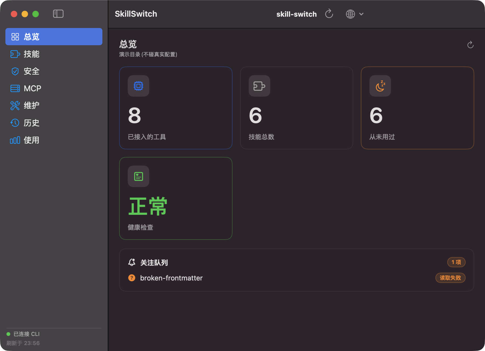
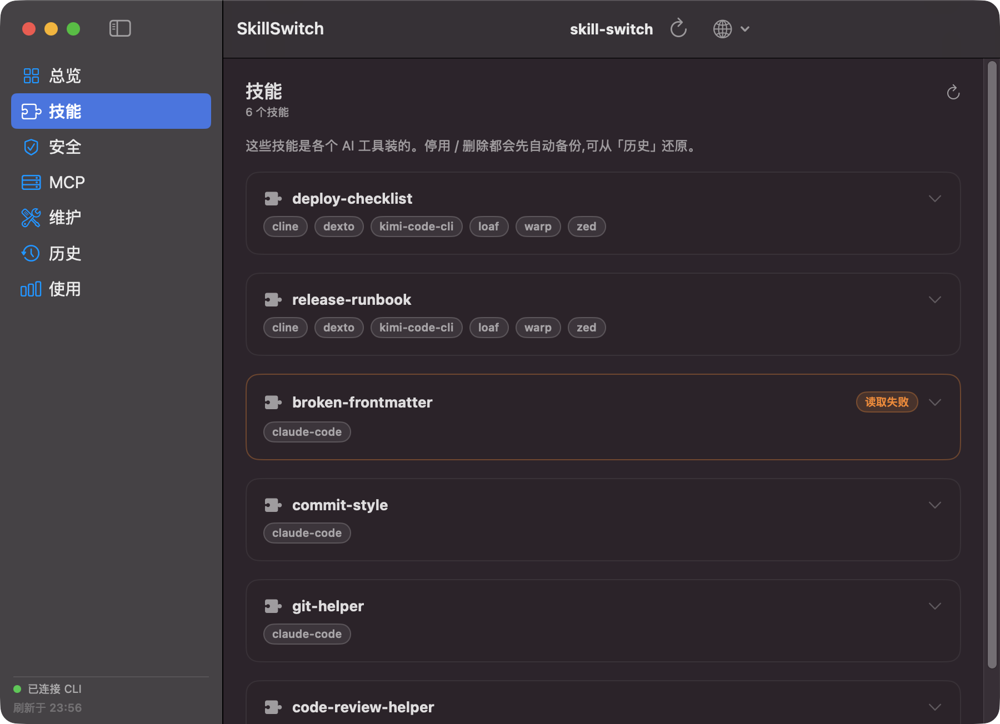
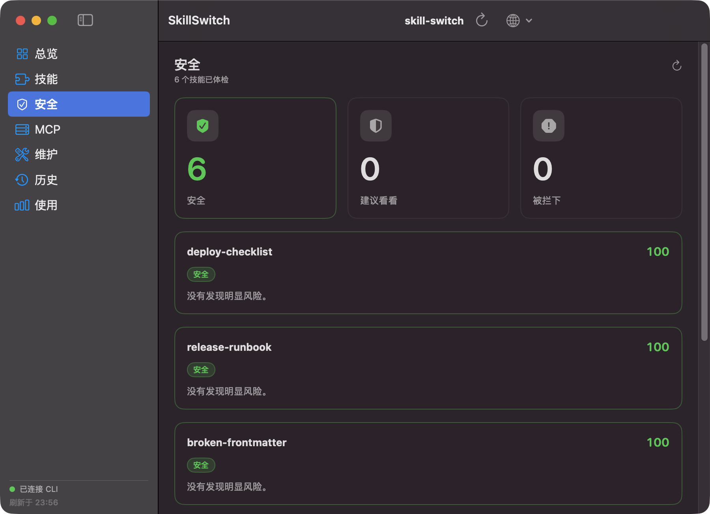
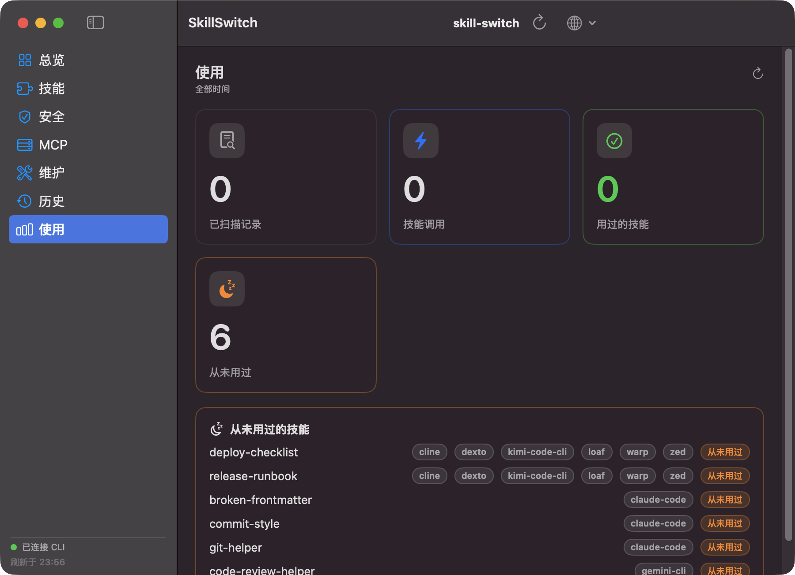

# skill-switch

<p align="center"><a href="./README.md">简体中文</a> · <b>English</b></p>

[](https://www.npmjs.com/package/@rtwsvj/skill-switch)
[](https://github.com/rtwsvj/skill-switch/releases)
[](./LICENSE)
[](https://github.com/rtwsvj/skill-switch/releases/latest)
[](https://github.com/rtwsvj/skill-switch/actions/workflows/ci.yml)

**Security audit for AI agent skills & MCP configs.** Scan the skills and MCP/agent configs of Claude Code, Cursor, Gemini CLI, Windsurf, Zed, and VS Code for **reverse shells, data exfiltration, credential phishing, dangerous MCP servers, plaintext remote transport, and hardcoded secrets** — 80+ detection rules, **1,600+ tests**. Emit **SARIF straight into GitHub code-scanning**, set a project policy (`.skill-switch-policy.json`), and apply guided fixes (`--fix`).

```bash
npx @rtwsvj/skill-switch audit            # audit this project's skills / configs
npx @rtwsvj/skill-switch audit --configs  # also scan ~/.claude, MCP, and agent configs
```

Or drop the [GitHub Action](docs/github-action.md) into CI to audit every PR and upload results to code-scanning.

On top of auditing, it's also a **cross-agent skill governance layer**: inventory, toggle, install, sync, and roll back — every write is **snapshotted first and one-click reversible**, and dangerous skills are blocked before they install. Available as a **CLI** (`npx @rtwsvj/skill-switch`) and a signed + notarized **native macOS app** (SwiftUI).

> Status: **v0.9.0** is shipped across all channels — npm `@rtwsvj/skill-switch@0.9.0` is `latest`, the GitHub Release `v0.9.0` carries a Developer ID-signed + Apple-notarized DMG, and the macOS app `skill-switch.app` is published alongside the CLI.



## Why

AI coding agents increasingly run on *skills* — reusable bundles of instructions and tools. As you accumulate them across several agents, you lose the thread: which are installed where, did that one quietly ask for your `.env`, is the copy on disk still the one you vetted? A skill is just files an agent will execute — so a bad one can open a reverse shell, exfiltrate secrets, or smuggle in hidden prompt-injection. skill-switch is the governance + safety layer that keeps all of that under control, locally, with no telemetry.

## Screenshots






## Highlights

- **Safety net** — every write (`install` / `toggle` / `sync` / `remove` / `restore`) takes a `tar.gz` snapshot *before* touching disk; one-click rollback to any point in time from the History view.
- **Pre-install security gate** — every skill is audited before it lands; reverse shells, secret exfiltration, phishing for credentials, and prompt-injection / hidden instructions get blocked. Forcing past the gate is recorded.
- **Three-way reconciliation** — `skills.json` (declared) × `skills.lock.json` (locked) × disk; `doctor` flags drift (`--ci` exits 1 on any mismatch).
- **Cross-agent** — one governance layer over claude-code / codex / gemini-cli / cursor / copilot.
- **Zero telemetry, local-first** — collects nothing, uploads nothing, no account; works fully offline after install (only an explicit `install` from a git source ever hits the network).
- **4 languages** — English / 简体中文 / 日本語 / Español.

## Install (macOS, Apple Silicon)

1. Download `skill-switch_0.9.0_aarch64.dmg` from the [latest release](https://github.com/rtwsvj/skill-switch/releases/latest).
2. Open it and drag **skill-switch** into Applications.
3. It's signed with a Developer ID and notarized by Apple, so it opens with a double-click — Gatekeeper won't block it.

The app only writes to your tools' skill directories (`~/.claude`, `~/.codex`, `~/.gemini`, …) when you explicitly click Install / Disable / Delete / Sync / Restore — and it snapshots before every write.

### What the native app does

A SwiftUI shell over the same CLI — seven sidebar screens: **Overview** / **Skills** / **Safety** / **Maintenance** / **History** / **Usage** / **MCP**. The MCP screen lists MCP servers from your configs (never connects by default); "Scan" shows a native confirmation stating exactly what local process will be launched or what URL will be requested, then fetches the live tool list, audits it, and flags rug-pull changes in plain language with a "re-accept" flow. Writes (`install` / `toggle` / `sync` / `remove` / `restore`) go through a native confirmation dialog + automatic pre-write snapshot, with audit results surfaced inline. **4 languages** (English / 简体中文 / 日本語 / Español) with an in-app toolbar switcher; light/dark theme follows the system.

## CLI

The CLI ships inside the app at `/Applications/skill-switch.app/Contents/Resources/skill-switch-cli`. Link it onto your `PATH`:

```bash
ln -sf /Applications/skill-switch.app/Contents/Resources/skill-switch-cli /usr/local/bin/skill-switch
skill-switch --help
```

> Tip: add `--home <some empty dir>` to any command to operate inside a throwaway sandbox that never touches your real config.

| Command | Purpose |
|---|---|
| `status` | One-glance overview: skill counts, agents detected, declaration/lock health (read-only; start here). |
| `scan` | Inventory installed skills per tool (read-only). |
| `init` | Scan installed skills and draft an initial `skills.json` (skips if one exists; `--force` to overwrite, `--dry-run` to preview). |
| `audit` | Security audit; any critical/high or score < 70 → exit 1. Add `--configs` to also audit agent config files (settings.json / MCP), covering Claude Code, Gemini CLI, Cursor, and VS Code. `--format junit` (Jenkins/GitLab/CircleCI), `--min-severity <level>` filter, `--exit-code <n>` (e.g. `0` for report-only), and inline `# skill-switch:suppress[ruleId]`. |
| `explain` | Explain an audit rule: what it detects, why it's dangerous, how to fix it, and the three suppression methods. `--json` for machine-readable output; unknown ruleId → exit 1 with suggestions. |
| `ci` | Scaffold a GitHub Actions workflow (`.github/workflows/skill-switch.yml`) in one command. `--format sarif` (default, uploads to code-scanning) or `--format github` (inline PR annotations); `--pin <ref>` to pin the action version; `--baseline` to also write a finding baseline so CI only fails on new findings; `--force` to overwrite an existing file; `--pre-commit` instead scaffolds a local `.pre-commit-config.yaml` gate. |
| `add` | **One-click install**: paste a GitHub link / `git clone` / `npx·npm` command → auto-parse the git source → clone (read-only) → audit each → list candidate skills with a safety verdict → install (a single non-dangerous one installs directly; for several, pick with `--skill`/`--all`). **Never executes the pasted command** (`curl\|bash` is refused); for an npm package it read-only-resolves the registry to find the source repo, then audits that. `--dry-run` previews only. |
| `install` | Install from a local or git source (audits + snapshots first). |
| `toggle` | Enable/disable a single skill per the declaration. |
| `sync` | Apply the declaration to disk (`--dry-run` to preview). |
| `remove` | Consistent teardown: disk + lock + declaration together. |
| `restore` | List / restore snapshots (`--latest` or `--id`). |
| `lint` | Spec checks + cross-tool portability + conflict/budget health. |
| `doctor` | Declared × locked × disk reconciliation (`--ci` exits 1 on drift). Also prints a "Config security:" advisory section summarizing critical/high config findings; `--json` includes a `configAudit` field (advisory only — does not affect exit code). |
| `diff` | Content drift, file-by-file: disk vs. stored copy; plus a one-line narrative summary (files changed, +N/−M lines, and whether a new security signal was introduced). |
| `drift` | Upstream HEAD / locked commit / local content three-way drift. `--review` approves drift one-by-one (cargo-vet style), `--approve-all` batch-approves; approved drift no longer counts toward `--ci` (auto-invalidated when content changes again). |
| `stats` | Trigger stats + dormant ("zombie") skills (`--days N`). |
| `packs` | **Discover packs from usage:** `packs suggest` reads your local conversations (skill names only) to suggest bundles of skills you use together; `packs save <id> [--enrich]` freezes one into a portable `pack.json` (`--enrich` back-fills sources from the lock for cross-machine reinstall); `packs install <pack.json|builtin-id>` installs a pack onto a new machine / another agent (`--lock` writes a reproducible lock; optional skills don't block on failure); `packs list [--builtin]` lists packs / builtin starter packs; `packs show <file>` inspects one; supports `extends` inheritance. |
| `mcp` | Run skill-switch as an **MCP server** (stdio) so agents like Cursor / Claude Code can call its **read-only** audit tools (`skill_switch_scan` / `status` / `audit`) in real time. Zero-dependency; never writes disk over this path. `--list-tools` to list exposed tools. |
| `mcp-scan` | **Runtime MCP audit (opt-in)**: connect to MCP servers from your configs, fetch the **live** tool list, audit tool descriptions with the 80+ static rules (catches tool poisoning), and fingerprint each tool definition into a baseline — on later scans a changed definition is flagged as a **rug-pull suspect** (`mcp/tool-definition-changed`, high; new tools medium). Safety posture: with no flags it only lists servers and **never connects**; `--server "<source>::<name>"` gives per-server explicit consent (TTY confirms one by one; non-TTY requires `--yes`; a stdio server means launching the configured command — stated before connecting); http is localhost-only, everything else must be https; **never calls tools** (`tools/call`); hard timeout kill (`--timeout <ms>`); header/env values never reach output or the baseline. `--reset-baseline` re-accepts the current list; `--ci` exits 1 on critical/high. See [docs/mcp-scan.md](docs/mcp-scan.md). |
| `lock` | Inspect the lock; `--verify` re-hashes disk to compare. |
| `export` | Bundle skills.json + skills.lock.json into a portable .ssp archive (read-only). |
| `import` | Restore skills.json + skills.lock.json from a .ssp archive (does not sync to disk). |
| `apm-import` | Interop with **microsoft/apm** (read-only): parse `apm.yml` / `apm.lock.yaml` and map its skill primitives into skill-switch's governance model. Defaults to a dry-run preview; `--apply` writes the declaration. Non-skill primitives (prompts / agents / hooks) are explicitly skipped. Never executes commands from the file; never hits the network. |
| `registry` | Read-only search from the official **MCP Registry**, the GitHub `marketplace.json`, and **SkillsMP** (optional, requires your own `SKILLSMP_TOKEN`), then **audit-and-install** skills / MCP servers (`registry search <query>`, `registry install <id>`). Strictly opt-in (only this command ever hits the network); HTTPS-only; zero telemetry; zero new deps; reuses the existing parse → clone → audit → gate pipeline. Dangerous sources are blocked by default and require `--force` with a recorded reason; remote content is never executed. The SkillsMP token is sent only to skillsmp.com, never logged, and never persisted by skill-switch. |
| `uninstall` | One-command uninstall of skill-switch itself. |
| `watch` | Detect skills on disk that bypass the governance layer (on disk but not declared); `--once` for a single pass, default is live watch. |
| `completion` | Print a bash / zsh / fish shell completion script. `eval "$(skill-switch completion bash)"` enables Tab completion immediately; or specify `zsh`/`fish`. |

Common options: `--json`, `--home <dir>`, `--agent <tool>` (claude-code / codex / gemini-cli / cursor / copilot …). Run any command with `--help` for the rest.

## Safety model

- **Read-only commands never write:** `status`, `scan`, `audit`, `lint`, `doctor`, `drift`, `stats`, `lock`.
- **Write commands snapshot first:** `install`, `toggle`, `sync`, `remove`, `restore` write a `tar.gz` to `~/.skill-switch/backups/` before changing anything; everything is reversible.
- **Audit before install:** anything matching reverse shells, sensitive-file exfiltration, credential phishing, unofficial package registries (`supply-chain/unofficial-registry`), or hidden/prompt-injection is blocked; you must `--force` (and leave a recorded reason) to override.
- **Config-file audit:** `audit --configs` scans Claude Code, Gemini CLI, Cursor, and VS Code config files (settings.json / MCP configs) for credential-path access (`mcp/credential-path-access`), hardcoded secrets, and dangerous MCP server patterns. `doctor` also surfaces the same findings as an advisory summary in its output.
- **Hardened boundaries:** rejects path-traversal / absolute / hidden skill names; copy mode doesn't follow symlinks; audit doesn't follow symlinks and caps size/count/depth/per-line matching. Known blind spots are documented in [docs/known-limitations.md](docs/known-limitations.md).
- **Zero telemetry, local-first:** no analytics, no account; all state lives in `~/.skill-switch/`.

## From source (developers)

```bash
pnpm install
pnpm cli --help                          # = skill-switch
pnpm cli scan --home tests/fixtures/home-basic
pnpm test
(cd macos && swift run)                 # run the native macOS app locally
pnpm release                             # build skill-switch.app (unsigned)
```

`pnpm release` runs `scripts/release.mjs`: tests + typecheck + `npm pack --dry-run` + `bash macos/build-app.sh`, producing `macos/dist/skill-switch.app`. The bundled CLI is a **Node SEA sidecar**, so the app runs CLI calls without a system `node`. Signing + notarization (Developer ID required) is documented in [macos/README.md](macos/README.md).

## More docs

- [docs/auditing-ai-agent-skills.md](./docs/auditing-ai-agent-skills.md) — security guide: the threat surface of AI agent skills & MCP servers, how to audit them, and how to gate them in CI.
- [docs/mcp-server.md](./docs/mcp-server.md) — run skill-switch as an MCP server so Cursor / Claude Code can call its read-only audit tools in chat.
- [docs/backlog.md](./docs/backlog.md) — research-derived product backlog: a prioritized roadmap.
- [docs/rules.md](./docs/rules.md) — rule catalog: every ruleId, severity, and a one-line description (80+ rules, grouped by threat category).
- [docs/roadmap.md](./docs/roadmap.md) — near-term hardening, medium-term features, long-term directions.
- [docs/troubleshooting.md](./docs/troubleshooting.md) — common problems and fixes (Gatekeeper, CLI PATH, audit blocks, doctor drift kinds, backups, uninstall).
- [docs/architecture.md](./docs/architecture.md) — contributor architecture overview: core modules, CLI layer, GUI, vendored snapshots, data model.
- [docs/known-limitations.md](./docs/known-limitations.md) — documented audit blind spots.
- [CHANGELOG.md](./CHANGELOG.md) — release history.

## License

MIT © 2026 rtwsvj. Third-party snapshots and porting-rule attribution: [THIRD_PARTY_NOTICES.md](./THIRD_PARTY_NOTICES.md).
