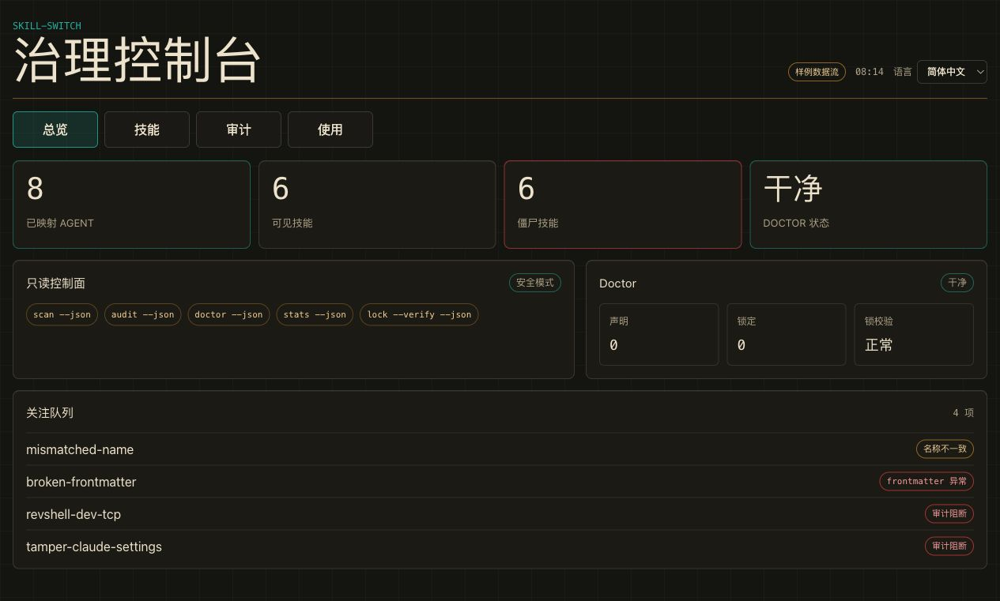

# skill-switch

<p align="center"><b>简体中文</b> · <a href="./README.en.md">English</a></p>

[](https://www.npmjs.com/package/@rtwsvj/skill-switch)
[](https://github.com/rtwsvj/skill-switch/releases)
[](./LICENSE)
[](https://github.com/rtwsvj/skill-switch/releases/latest)
[](https://github.com/rtwsvj/skill-switch/actions/workflows/ci.yml)

**AI agent skills 与 MCP/agent 配置的安全审计器。** 在 Claude Code、Cursor、Gemini CLI、Windsurf、Zed、VS Code 等工具的 skill 与配置里,扫出**反弹 shell、外传敏感文件、钓鱼式索要凭据、危险 MCP server、明文远程传输、硬编码密钥**等危险模式——**80+ 条检测规则、1,600+ 测试**;输出 **SARIF 直通 GitHub code-scanning**,支持项目级策略(`.skill-switch-policy.json`)与受控修复(`--fix`)。

```bash
npx @rtwsvj/skill-switch audit            # 立刻体检当前项目的 skills / 配置
npx @rtwsvj/skill-switch audit --configs  # 连 ~/.claude、MCP 等 agent 配置一起查
```

或把 [GitHub Action](docs/github-action.md) 丢进 CI,每个 PR 自动审计 + 上传 code-scanning。

在审计之上,它还是个**跨 agent 的 skill 治理层**:盘点 / 开关 / 安装 / 同步 / 回滚——所有写操作**先自动备份、可一键回滚**,危险 skill 装前即被拦。**命令行(CLI)** 与**桌面 App(GUI)** 两种用法,能力对等。

> 状态:**v0.7.0**。CLI 已发布 npm(`npx @rtwsvj/skill-switch`);macOS 桌面 App 已 Developer ID 签名 + Apple 公证,双击即用。


## Screenshots




## 安装(macOS,Apple Silicon)

1. 双击 `skill-switch_0.7.0_aarch64.dmg`,把 **skill-switch** 拖进「应用程序」。
2. 首次打开:双击图标 → 出现「下载自互联网,确认打开吗」点**打开**(已签名公证,不会被 Gatekeeper 拦)。
3. 默认中文界面,右上角可切语言(见下)。

App 只在你点「安装/停用/删除/同步/还原」时才写入本机各工具的 skill 目录(`~/.claude`、`~/.codex`、`~/.gemini` 等),且每次写入前自动备份。

## GUI 全部能力

顶栏:**语言**切换、**高级**开关(默认关;打开后才显示底层命令条和一致性明细等技术信息)。界面语言覆盖 **zh-CN**、**en**、**ja**、**es** 四种。

- **总览**:四个指标——已接入的工具、技能总数、从未用过(零调用)、健康检查(声明/锁/磁盘是否一致);**安装与维护**面板;**关注队列**(名称不一致 / 解析报错 / 被体检拦下的 skill)。
- **技能**:每个 skill 一行,状态(已启用/已停用),每行两个按钮——**停用/启用**、**删除**。停用会暂时关掉并保留在列表(随时可再启用);删除彻底移除。两者都先自动备份。
- **安全**:每个 skill 的安全评分 + 裁决(SAFE/REVIEW/DANGER)+ 命中的风险点;评分 < 70 或有 critical/high 的会被拦。
- **使用**:每个 skill 的触发次数,并列出「僵尸」skill(装了却从没被调用)。
- **安装与维护(写操作)**:**安装**(来源 git/本地 → 目标工具 → 保存方式 →「安装」,装前自动体检,危险源进「被拦」列表,确需安装勾「遇到拦截也继续」)、**同步**(先「预览」再「开始同步」)、**撤销(历史备份)**(「查看备份」选一个还原)。

GUI 写操作走 `install/toggle/sync/remove/restore`,统一**确认 + 快照 + audit** 护栏:弹确认框 → 执行前自动拍快照(界面显示备份路径)→ 完成后刷新。

## CLI 全部能力

### 让 `skill-switch` 命令可用

装好 App 后,CLI 已随 App 带上,在 `/Applications/skill-switch.app/Contents/MacOS/skill-switch-cli`。链到 PATH 即可直接用:

```bash
ln -sf /Applications/skill-switch.app/Contents/MacOS/skill-switch-cli /usr/local/bin/skill-switch
skill-switch --help
```

> 试手小贴士:任何命令加 `--home <某个空目录>` 就只在那个假目录里操作,完全不碰真实配置。

### Commands

| Command | Purpose | Example |
|---|---|---|
| `scan` | 盘点各工具已装的 skill(只读;坏样本以 `error` 字段呈现)。 | `skill-switch scan` |
| `init` | 扫描已安装 skill,草拟 `skills.json` 初始声明(已存在则跳过,`--force` 覆盖,`--dry-run` 只看草稿)。 | `skill-switch init --dry-run` |
| `audit` | 安全体检:给路径=单个 skill,不给=全量;有 critical/high 或评分<70 → exit 1。`--format human`(默认)`/json/sarif`(SARIF 2.1.0 接 GitHub code-scanning)。`--configs` 检查 Claude Code、Gemini CLI、Cursor、VS Code、Windsurf、Zed 的 settings/MCP 配置。`.skill-switch-policy.json`(或 `--policy`)可设 `failOn` 阈值 + `suppress` 抑制。`--fix` 预览受控修复、`--fix --apply` 落盘(先备份)。 | `skill-switch audit ./my-skill --format sarif` |
| `ci` | 一键生成 GitHub Actions 工作流(`.github/workflows/skill-switch.yml`),接入 skill-switch CI 审计。`--format sarif`(默认,上传 code-scanning)或 `--format github`(PR 内联注解);`--pin <ref>` 固定 action 版本;`--baseline` 同时写入 finding 基线让 CI 只报新问题;`--force` 覆盖已有文件。 | `skill-switch ci --format github --baseline` |
| `install` | 安装本地或 git 来源:装前 audit + 装前快照,写 lock 与声明。 | `skill-switch install ./my-skills --agent claude-code` |
| `toggle` | 按声明开关单个 skill(同步前自动快照)。 | `skill-switch toggle tidy-notes --off` |
| `sync` | 把声明应用到磁盘(`--dry-run` 只看计划)。 | `skill-switch sync --dry-run` |
| `remove` | 一致性拆除:磁盘产物 + 锁 + 声明一起清。 | `skill-switch remove tidy-notes --agent codex` |
| `restore` | 列出 / 还原备份(`--latest` 或 `--id`)。 | `skill-switch restore --latest` |
| `lint` | 规范校验 + 跨工具移植告警 + 冲突 / 预算健康度。 | `skill-switch lint --target codex` |
| `doctor` | 声明/锁/磁盘三方一致性(`--ci` 不一致即 exit 1)。同时显示「配置安全:」advisory 段落(critical/high 配置问题摘要;`--json` 含 `configAudit` 字段;不影响退出码)。 | `skill-switch doctor` |
| `diff` | 内容漂移的「改了什么」:磁盘 vs store 副本,逐文件 added/removed/modified。 | `skill-switch diff my-skill` |
| `drift` | 上游 HEAD / 锁定 commit / 本地内容 三方漂移。 | `skill-switch drift` |
| `stats` | 触发统计 + 僵尸清单(`--days N`)。 | `skill-switch stats --days 30` |
| `lock` | 查看锁;`--verify` 重算磁盘哈希比对。 | `skill-switch lock --verify` |
| `export` | 把 skills.json + skills.lock.json 打包成可携带的 .ssp 档案(只读)。 | `skill-switch export --out my.ssp` |
| `import` | 从 .ssp 档案还原 skills.json + skills.lock.json(不执行 sync)。 | `skill-switch import my.ssp --force` |
| `uninstall` | 一键卸载本软件(见下节)。 | `skill-switch uninstall` |
| `watch` | 检出磁盘上绕过治理层的 skill(不在声明中但在磁盘上);`--once` 单次扫盘,默认持续监视。 | `skill-switch watch --once` |

公共选项:`--json`、`--home <dir>`、`--agent <工具>`(claude-code / codex / gemini-cli / cursor / copilot …)。每个命令 `--help` 看全部。

### Exit Codes

- 只读命令能出报告就 exit 0。
- `audit` 在该拦截时 exit 1(任意 critical/high 或评分 < 70)。
- `doctor --ci` 在声明/锁/磁盘不一致时 exit 1。
- `lock --verify` 在锁定目标缺失/未知/哈希不符时 exit 1。
- 出错统一打印 `错误: <信息>` 到 stderr 并 exit 1(无堆栈)。

## 一键卸载

完整移除本软件,一条命令:

```bash
skill-switch uninstall
```

它会删除 `/Applications/skill-switch.app`、`~/.skill-switch`(声明/锁/内容库/备份)、`skill-switch` 命令链接,**默认保留你已经装好的各个 skill**(它们继续可用)。可选:

- `--purge-skills`:连同本软件装进各工具的 skill 也一并移除(每个先快照)。
- `--dry-run`:只列会删什么,不真删。
- `--yes`:跳过确认。

> 只装了 App、没链接 CLI:直接跑 `/Applications/skill-switch.app/Contents/MacOS/skill-switch-cli uninstall`。
> 手动兜底:`rm -rf /Applications/skill-switch.app ~/.skill-switch`,再删掉你建过的 `skill-switch` 链接。

## Safety Model(为什么可以放心点)

- **只读命令永不写盘**:`scan`、`audit`、`lint`、`doctor`、`drift`、`stats`、`lock`。
- **写命令先做装前快照再动手**:`install`、`toggle`、`sync`、`remove`、`restore` 修改前在 `~/.skill-switch/backups/` 拍 tar.gz 快照,`restore` 还原前再拍一份;任何一步都能回滚。
- **安装前安全体检**:任何 skill 装进来前先 audit,命中反弹 shell、外传敏感文件、钓鱼式索要凭据、非官方 registry 安装(`supply-chain/unofficial-registry`)等会被拦,需 `--force` / 勾「遇到拦截也继续」才放行。
- **配置文件审查**:`audit --configs` 检查 Claude Code、Gemini CLI、Cursor、VS Code、Windsurf、Zed 的 settings.json / MCP 配置,检测配置凭据路径访问(`mcp/credential-path-access`)、硬编码密钥、危险 MCP server 等;并做静态运行时能力分析——明文 `http://` 远程传输、`autoApprove`/`alwaysAllow` 全量/批量自动批准、根/家目录范围参数、`--no-sandbox` 等危险权限标志(全程零进程 / 零网络)。`doctor` 也会在输出中附上同类发现的 advisory 摘要。
- **加固边界**:拒绝路径穿越/绝对路径/隐藏名等不安全 skill 名;copy 模式不跟随软链;audit 不跟随软链且有大小/数量/深度/单行匹配上限。已知盲区见 [docs/known-limitations.md](docs/known-limitations.md)。
- **零遥测 · 本地优先**:skill-switch 不收集、不上传任何数据,没有分析/遥测/账号。所有操作都在你本机完成,配置只写到 `~/.skill-switch/`,装好后**可完全离线使用**(只有显式从 git 来源 `install` 时才联网拉取那一个仓库)。

## 数据文件(都在 `~/.skill-switch/`)

- `skills.json`:声明你希望哪些 skill 出现在哪些工具。
- `skills.lock.json`:每个 skill 的来源、commit、内容哈希、保存方式。
- `backups/`:所有写操作的自动快照。
- `store/`:copy 安装的耐久内容库(停用后从这里还原)。

## 从源码运行(开发者)

clone + run 始终支持:

```bash
pnpm install
pnpm cli --help                          # = skill-switch
pnpm cli scan --home tests/fixtures/home-basic
pnpm test
pnpm --dir gui tauri dev                 # 本地起 GUI
pnpm release                             # 一键产出 .app / .dmg(不签名)
```

`pnpm release` 产出 `gui/src-tauri/target/release/bundle/dmg/skill-switch_0.7.0_aarch64.dmg`。打包后的 CLI 用 **Node SEA sidecar**,所以 App 不需要系统 `node` 也能跑 CLI 调用。

签名 + 公证(需 Developer ID,见 [docs/release/signing.md](docs/release/signing.md)):

```bash
APPLE_SIGNING_IDENTITY="Developer ID Application: <你的身份>" pnpm --dir gui sign
```

## 更多文档

- [CHANGELOG.md](./CHANGELOG.md):版本变更。
- [docs/auditing-ai-agent-skills.md](./docs/auditing-ai-agent-skills.md):安全指南——AI agent skills 与 MCP server 的威胁面、如何审计、如何接入 CI。
- [docs/rules.md](./docs/rules.md):审计规则目录——所有 ruleId、严重度与一句话说明（80+ 条规则，按威胁类别分组）。
- [docs/roadmap.md](./docs/roadmap.md):路线图——近期加固、中期功能、远期探索。
- [docs/troubleshooting.md](./docs/troubleshooting.md):常见问题与解决方法（Gatekeeper、CLI 路径、audit 拦截、doctor 漂移、备份还原、卸载）。
- [docs/architecture.md](./docs/architecture.md):贡献者架构概述——核心模块、CLI 层、GUI、vendored 快照与数据模型。
- [docs/release/signing.md](./docs/release/signing.md):macOS 签名与公证。
- [docs/known-limitations.md](./docs/known-limitations.md):已知限制。
- [THIRD_PARTY_NOTICES.md](./THIRD_PARTY_NOTICES.md):第三方快照与移植规则署名。
